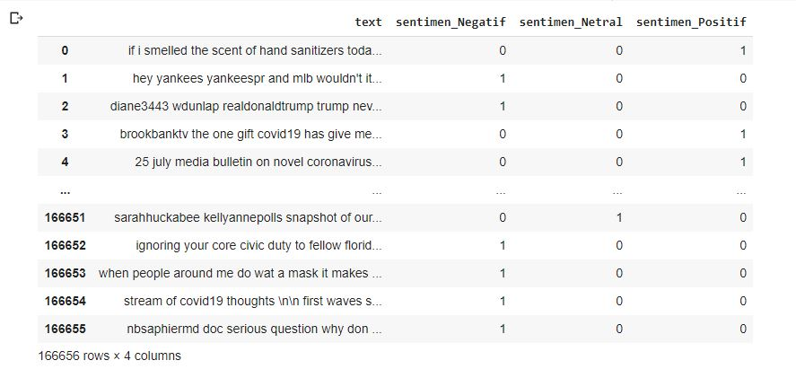
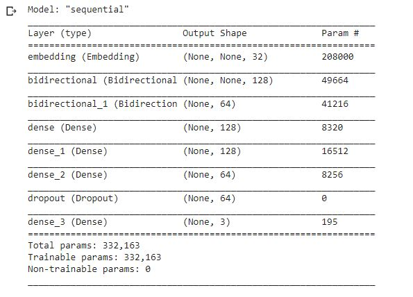
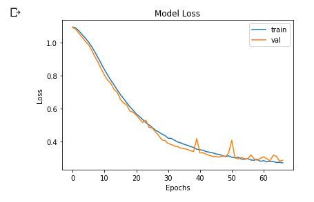
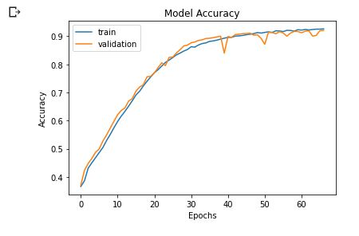
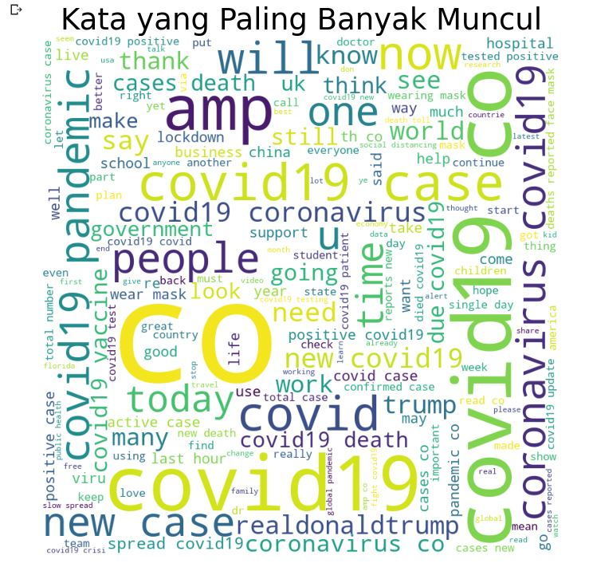
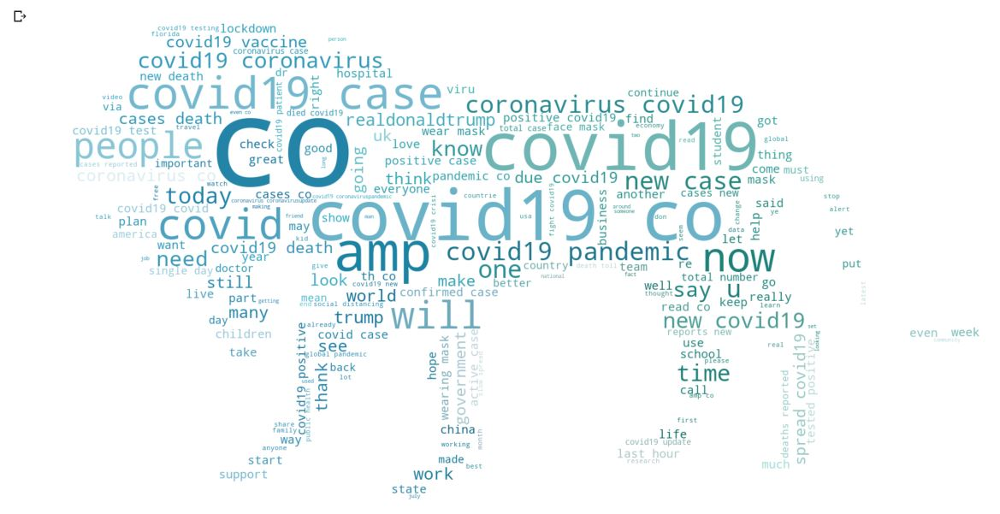

# NLP_with_LSTM
Solve NLP Problem with LSTM model

Using covid19-tweets which consists 166656 row, can be found on Kaggle https://www.kaggle.com/gpreda/covid19-tweets 

# Dataframe Sentiment Preview

# LSTM Model Layer

# Model Loss & Accuracy Plot
Loss plot :

Accuracy plot :

# Visualization with WordCloud

# Lion visualization

